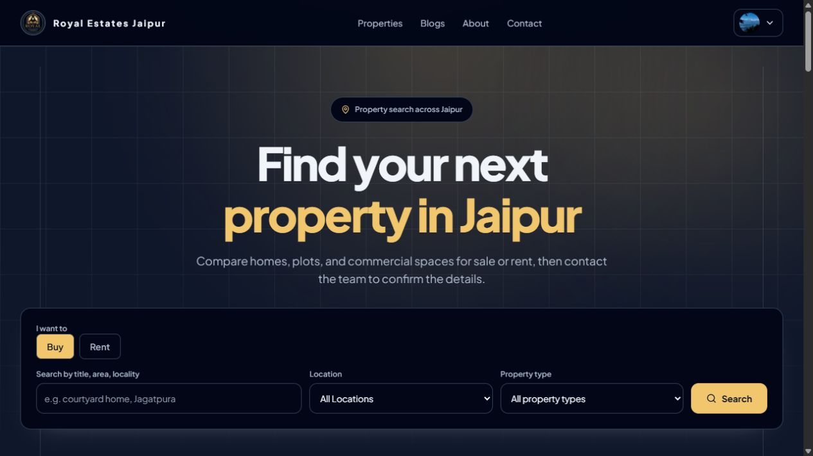
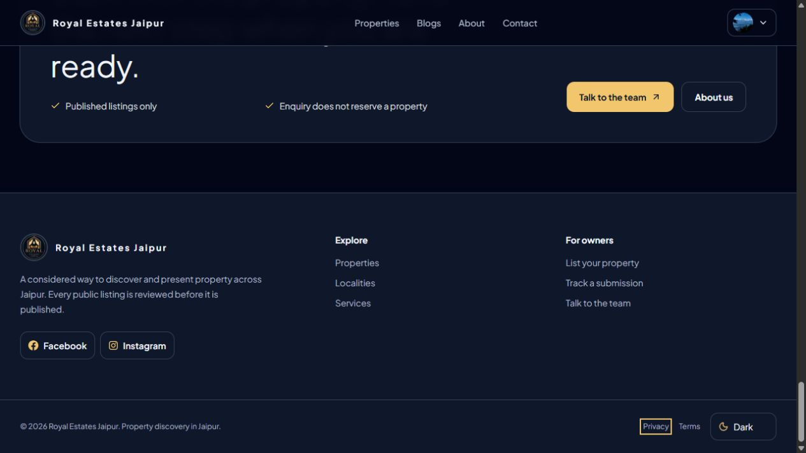
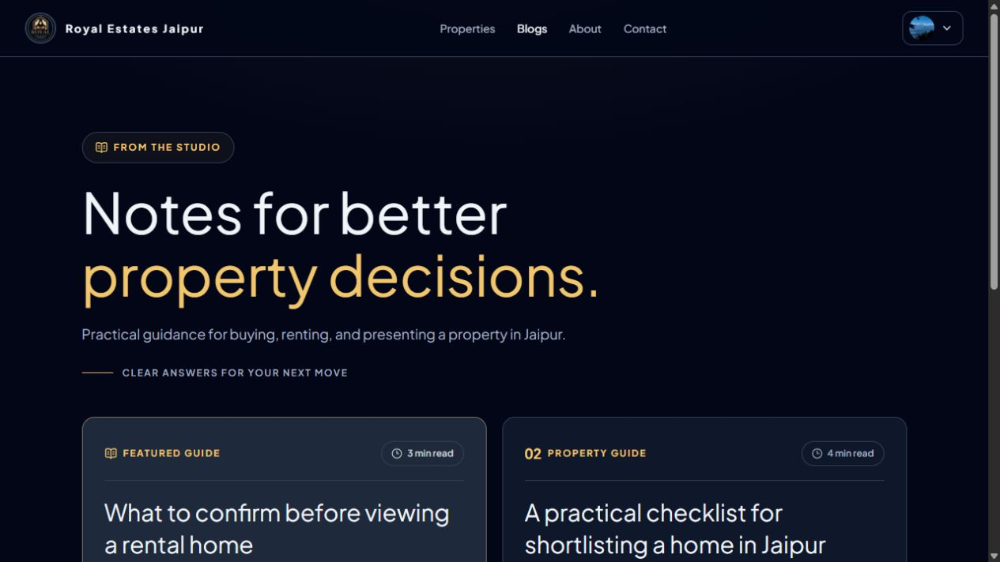

# Repository, authentication and UI audit — 2026-10-03

Scope: current MLS-RealEstate source, live public home/footer/journal, Crossworld layout research, authorized InsForge target, and the user-supplied voice-agent-app reference. This is a baseline review, not a penetration test or a claim of full accessibility compliance.

## 1. Verified service and tool state

- InsForge login/link: succeeded for RealEstate-MLS, project `e37d17ef-599d-470b-b821-4304da8015aa`, us-east.
- Project active, nano instance, backend service version 2.3.2; organization billing reports free.
- Read-only SQL inventory: 0 public base tables. Storage inventory: 0 buckets.
- Auth metadata: Google and GitHub listed; email verification required, minimum password length 6; application redirect allowlist empty. Google callback/real login has not been tested.
- Existing Prisma 6.19.3 direct connection to the InsForge database: `SELECT 1` passed. Schema deployment, transactions, TLS/pool configuration and runtime load remain unverified.
- Current Supabase diagnostic: Auth endpoint, bootstrap password sign-in, application Profile and query of 6 site settings passed.
- Application-level admin sign-in/access not verified by that diagnostic: configured local server was unreachable.
- Vercel inspection: production Ready, deployment `dpl_5DBiesRuihb9Lukdt2U6JfDbxCza`, canonical alias https://royalestatejaipur.vercel.app/.
- GitHub CLI and Vercel CLI authenticated. No dedicated GitHub/Vercel/InsForge MCP namespace was exposed in this session.
- Repository started clean at `564595b`. Planning branch is `codex/insforge-redesign-plan`.
- Local browser tab at `127.0.0.1:3000/blogs` showed an unreachable server. The live Vercel journal rendered successfully; this local failure is not evidence of a fresh Prisma crash.

Private keys, database connection URLs and metadata reports were kept under ignored `.insforge/`; no credentials are included here.

## 2. Repository and API map

| Boundary | Current modules | Review priority |
| --- | --- | --- |
| Routing | Next.js App Router, public pages, account/admin, auth callback, 31 API route handlers | Preserve route contracts; keep pages thin |
| Identity | `lib/supabase/`, `lib/auth/`, `features/auth/`, `app/api/auth/` | SSR refresh, provider callback, Profile role/status |
| Domain | `features/submissions/`, `features/properties/`, `features/enquiries/` | Ownership, transition validation, atomic publication/audit |
| Content | `features/blog/`, `features/site-content/`, `features/site-appearance/` | CRUD permissions, public projection, bounded reads |
| Media | Property/submission/documents, blog assets, avatars | Private/public policies, publication transfer, cleanup recovery |
| Persistence | `prisma/schema.prisma`, 16 models, 8 migrations, `lib/db/` | Stable UUIDs/FKs, migration ownership, runtime pool |
| Feedback | Loading/error boundaries, inline validation, toasts | Complete failed/pending/empty states in every real flow |
| Tests | Vitest, component tests, `e2e/`, Axe | Real sessions/uploads vs mocked flows; unauthorized paths |

Useful existing controls: server role/owner guards, published-only public queries, integer minor-unit prices, Zod schemas, idempotent Profile provisioning, moderation transactions/audit, upload MIME/signature validation and safe internal redirect handling. Retain these during migration.

## 3. Prioritized engineering findings

Findings below distinguish observed defects from risks requiring a targeted test.

| ID / priority | Evidence | Impact / action | Phase |
| --- | --- | --- | --- |
| PKG-01 / high | Current full npm audit reports 11 high findings; production-only audit 0 | Patch compatible development transitive chains. npm proposes Next/Prisma downgrades; do not force those changes | 1 |
| AUTH-01 / high | No root `proxy.ts` or `middleware.ts`; `lib/supabase/server.ts` catches failed cookie writes during Server Component reads | Missing refresh boundary risks stale/expired SSR sessions. Add provider-documented refresh Proxy and verify expired/revoked sessions | 1, 5 |
| AUTH-02 / medium | `app/api/auth/sign-in/route.ts` redirects after Profile provisioning without ACTIVE status check; OAuth callback explicitly checks it; DAL guards fail closed | Login behavior for suspended users is inconsistent. Sign out/deny consistently and test both providers; this review did not prove a guarded API bypass | 1, 5 |
| AUTH-03 / high release gate | New InsForge auth metadata has no allowed app redirects; no browser OAuth callback completed | Provider listing alone cannot prove sign-in works. Configure exact origins, PKCE/verifier cookies, callback and role resolution | 5 |
| API-01 / medium risk | Cookie-auth Route Handler mutations lack a shared origin/CSRF policy; sign-in parses formData outside an error boundary | Audit and test cross-origin behavior and malformed payloads; add same-origin defense/request size/type checks. No exploit demonstrated here | 1 |
| RATE-01 / medium | `lib/security/rate-limit.ts` stores counters in a process-local Map and uses first x-forwarded-for entry | Counters reset across instances; trusted origin/header policy needs verification. Add durable counters with atomic duplicate guards | 1 |
| DATA-01 / high migration gate | Profile IDs currently equal Supabase auth UUIDs and are referenced by owners/staff/authors/reviewers/audit | Preserve stable Profile IDs with a protected new identity mapping or supported import. Password hash portability is unverified | 5, 6 |
| DATA-02 / medium | `features/blog/service.ts:getPublishedBlogPosts` has no take/skip or cursor bound | Public journal will grow without pagination. Bound reads and query only required fields | 1, 3 |
| STORAGE-01 / medium resilience | Six buckets and publication/cleanup span DB plus Storage; prior phase log notes durable retry/outbox remains outstanding | A failed copy/delete needs durable retry and reconciliation; Prisma transaction alone cannot commit object-storage work atomically | 4, 6 |
| TOOL-01 / low | shadcn specified, but no components.json and most controls locally authored; only Radix Slot installed | Establish compatible config and add reviewed accessible primitives selectively | 2 |
| PERF-01 / medium | `app/layout.tsx` declares 10 fonts; Manrope/Cormorant preload despite another active theme | Scope optional font previews and prioritize the actual selected default; measure font requests/layout shift before claiming a performance win | 2 |
| QA-01 / release gate | Admin E2E can skip without credentials; owner media flow intercepts API responses | Historical passing tests do not prove migrated real auth/upload. Add controlled real backend fixtures, lifecycle checks and report skipped external checks | 4–8 |
| CONTENT-01 / high launch gate | Live homepage still links preview/test properties | Unpublish/replace or unmistakably identify demos before launch; verify content/media rights and business details | 3, 8 |
| FREE-01 / operational limit | InsForge current pricing pauses free projects after a week without activity | Migration does not guarantee continuous availability. Record capacity/restore procedure and unavailable UI | 6–8 |

### Package snapshot

Full audit: 11 high, 0 critical, 0 moderate, 0 low. Affected reported nodes include `@next/eslint-plugin-next`, `eslint-config-next`, `fast-glob`, `micromatch`, `braces`, `brace-expansion`, `js-yaml`, `undici`, `prisma`, `@prisma/config`, `deepmerge-ts`.

These are dependency-tree findings, not 11 separately proven remotely exploitable application defects. Review patch ranges, affected tool behavior, tests and overrides individually. Production-only audit is currently clean. No package versions were changed in this planning stage.

## 4. Current browser evidence and design findings

Captured through the browser plugin during this run, saved locally and reopened for inspection. The screenshots show the current production dark theme at 1265 × 712; responsive/light-theme/contrast testing is still required.

### Step 1 — Home task entry

- Strengths: centered task entry, Buy/Rent radios, visible labels, location/type defaults, prominent Search.
- Observed polish issues: dense heading tracking and a heavy grid/glow background; action area occupies much of the opening viewport.
- Recommendation: relax typography, tighten form geometry, use one adapted visible but finite Aceternity effect, and implement the proposed coherent theme.
- Accessibility limits: screenshot alone cannot measure contrast, reduced-motion behavior or keyboard order. Source currently uses repeat: Infinity on decorative glow motion; reduced motion is supported, but there is no pause control. Replace with a finite effect or provide pause/stop for longer autoplay.

### Step 2 — Bottom of homepage

- Strengths: theme selector is correctly in the footer; Privacy shows visible keyboard focus; owner and explore links are separated.
- Observed UX issue: the footer has no direct business phone/email contact methods; it depends on navigating to Contact. Secondary content appears muted; measure its contrast rather than declaring a failure from the image.
- Recommendation: add approved contact actions and consistent hierarchy, keep footer theme controls, make the final owner CTA explicit and concise.
- Screenshot limit: the preceding CTA is partially above the viewport; this capture is evidence for the footer, not a complete CTA review.

### Step 3 — Journal entry

- Strengths: large heading, featured guide hierarchy, article metadata, two original articles.
- Observed UX issue: the heading/introduction consume most of the initial view; reading actions are below this capture. The cards compete through text density rather than meaningful editorial imagery.
- Recommendation: concise heading scale, one stronger featured card, approved cover imagery or intentional text-first design, consistent metadata and a distinct Read article action.
- Limits: this screenshot does not prove article CTA contrast or article-page reading behavior.

### Reference observations

Home, catalogue, about and contact were reviewed live. The reference uses **Plus Jakarta Sans** in computed body/heading styles. Its home sequence supports the search-first plan; its catalogue supports URL filters and a photo-led grid; its about/contact structures are simpler than the current verbose public copy. The detailed page contract is in PLAN.md.

This is product-pattern research, not permission to copy business claims, photos, code or branded content. [Reference](https://www.crossworldproperties.com/)

## 5. Voice-agent-app authentication comparison

Reference root: `E:/c++/Arduino/AI-VoiceAssitant/voice-agent-app`. Both parent and nested AGENTS files were read; no changes or backend commands were executed in that reference project.

| Observed pattern | Reuse in MLS | Adaptation required |
| --- | --- | --- |
| SDK 1.5.2, separate environment base URL/anon key | SDK and environment approach | Use this site's linked endpoint; do not copy fallback host/keys |
| Browser email/signup and Google/GitHub initiation | Provider behavior/error handling reference | Native server auth actions/PKCE callback for SSR |
| useRequireAuth + AuthGate | Loading/redirect affordance | Client gating never authorizes admin pages or mutations |
| auth.uid ownership policies | Owner policy concept | Add staff/role/PII/public-status policies; no blanket user-editable staff data |
| Redirect allowlist for local/production | Check-in safe provider config | Exact controlled preview/production callbacks and safe next intent |
| Email verification disabled, password minimum 6 | Do not copy these product settings | Real-estate uses verified identity, stronger agreed password policy and reset lifecycle |

No successful login was independently verified in the voice app during this audit; source patterns alone are not proof of its deployed security.

## 6. Verification performed and limitations

| Check | Result |
| --- | --- |
| npm audit --json | Findings: 11 high development nodes |
| npm audit --omit=dev --json | Pass: 0 |
| InsForge CLI login/link, memory list | Pass; no existing project memories |
| InsForge projects get / billing status | Pass: active/free |
| InsForge metadata, public-table SQL, storage buckets | Pass: empty target; auth setup required |
| Prisma read-only InsForge SELECT 1 | Pass |
| npm run diagnose:admin | Supabase/password/profile/DB pass; application server unavailable; admin journey not tested |
| vercel inspect | Ready production deployment |
| Browser home/footer/journal | Captured and inspected |
| Reference/browser font and page structure | Inspected |
| Reference repo auth source | Read-only inspection |
| Automated application regression suite | Not rerun for this docs/tooling stage; required in Phase 1 onward |
| OAuth chooser/callback, migration/RLS, restore, delivery | Not verified yet |

Review guidance: [Vercel React skills](https://github.com/vercel-labs/agent-skills), [current web interface guidelines](https://github.com/vercel-labs/web-interface-guidelines/blob/main/command.md), installed InsForge SSR guidance, and bundled Next.js 16 Proxy guide.

Next action: Phase 1 dependency and API/security hardening from PLAN.md, followed by a verified design-system preview.
